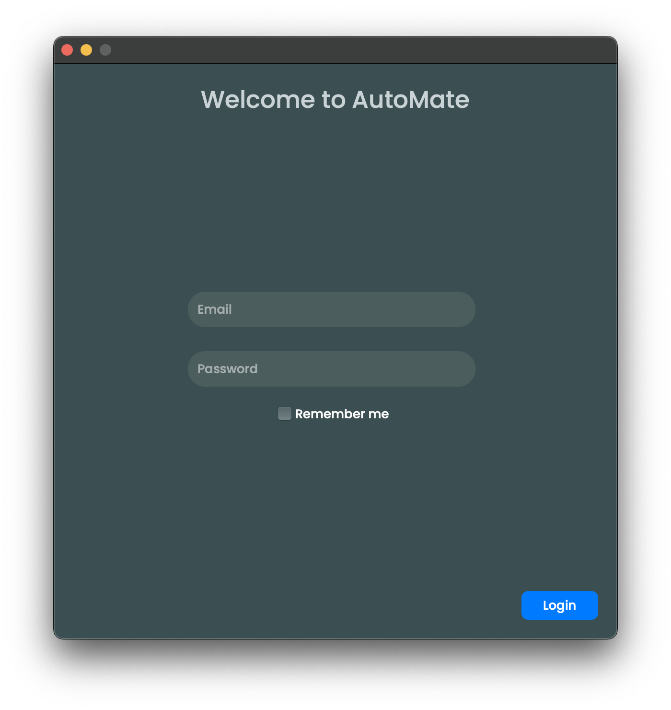
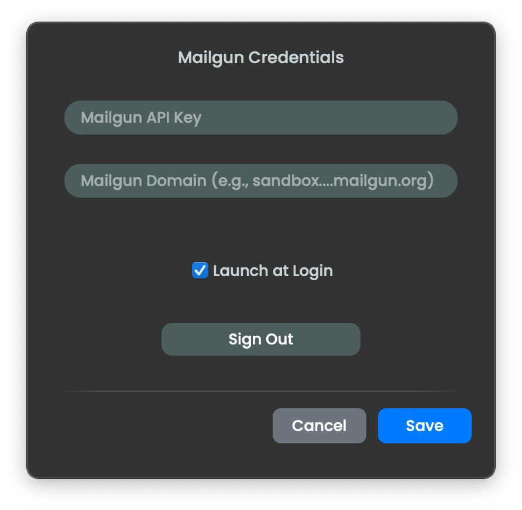
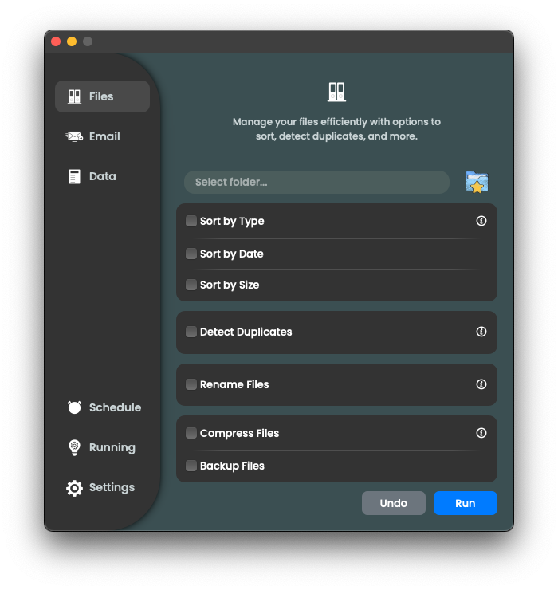
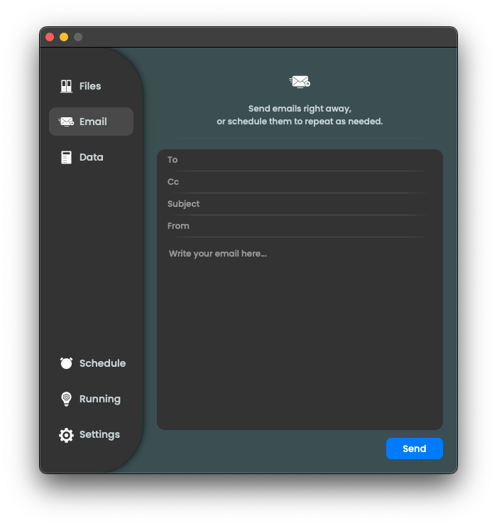
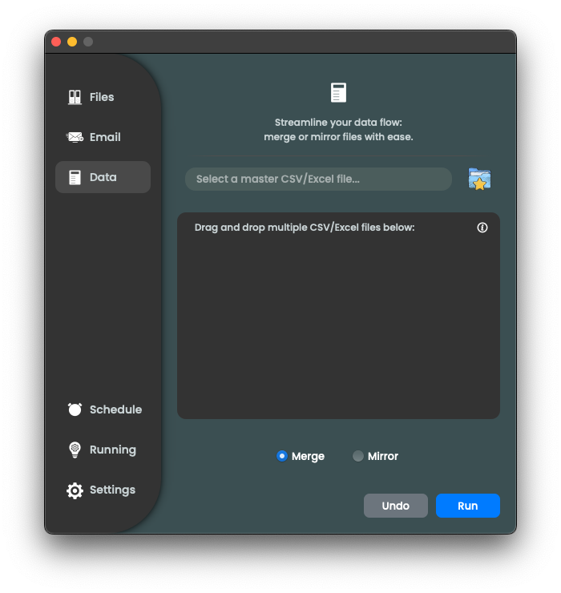
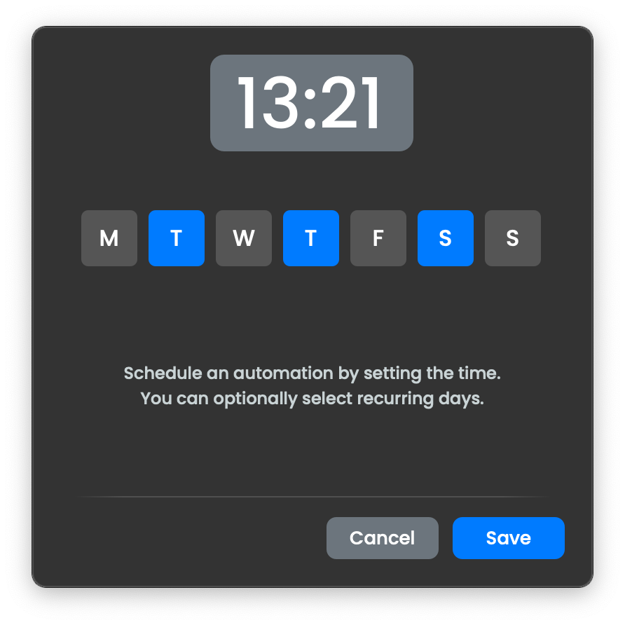
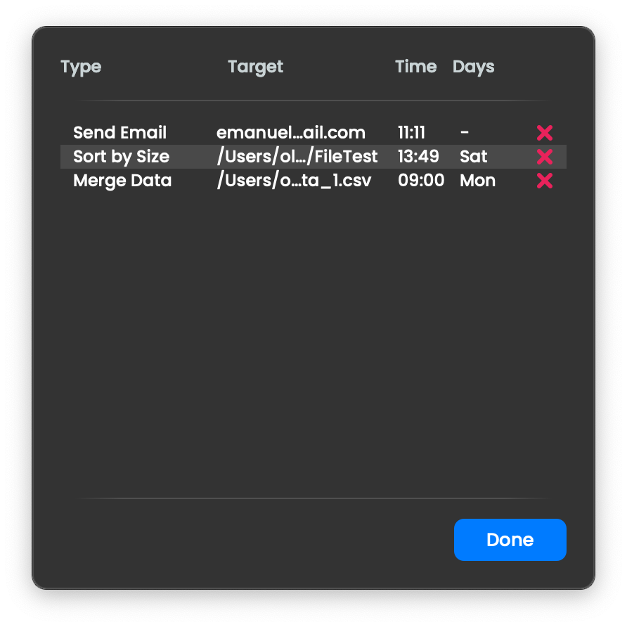
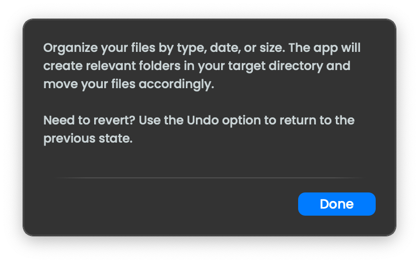

<h1 align="center">AutoMate</h1>

  

**AutoMate** automates common tasks like organizing files, sending emails (via Mailgun), and managing data, all through a user-friendly interface built with PyQt5. Keep your files tidy, schedule tasks, and streamline data operations easily.

  

# Table of Contents

- [Features](#features)
- [Installation](#installation)
  - [Windows](#windows)
  - [macOS](#macos)
- [Getting Started](#getting-started)
- [Usage](#usage)
  - [Settings](#settings)
  - [Files](#files)
  - [Email](#email)
  - [Data](#data)
  - [Schedule](#schedule)
  - [Running](#running)
  - [Info](#info)
- [Undo](#undo)
- [Reporting Issues](#reporting-issues)
- [Attribution](#attribution)

## Features

-   **File Organization**: Sort files by type, date, and size. Rename, compress, backup, and detect duplicate files.
-   **Email Sending**: Send emails with attachments using your Mailgun account. Schedule emails for later delivery.
-   **Data Entry Automation**: Merge and mirror data across multiple CSV/Excel files intelligently.
-   **Automation Scheduling**: Set file organization or email tasks to run automatically at specific times or on chosen days.
-   **User-Friendly Interface**: Clean and intuitive interface for easy access to all features.
-   **Secure Local Authentication**: Your login password is securely hashed and stored only on your local machine.

## Installation

Download the latest version for your operating system from the [**AutoMate Releases Page**](https://github.com/OldManny/AutoMate/releases/latest).

## Windows

1.  Download the `.exe` installer file from the Releases page.
2.  Double-click the downloaded `.exe` file.
3.  Follow the on-screen prompts to complete the installation.
4.  Launch AutoMate from your Start Menu or Desktop shortcut.

### macOS

1.  Download the `.dmg` disk image file from the Releases page.
2.  Double-click the downloaded `.dmg` file to mount it.
3.  Drag the `AutoMate.app` icon into your `Applications` folder.
4.  You may need to grant permission to run an application downloaded from the internet the first time you open it (Right-click -> Open, or via System Settings > Privacy & Security).
5.  Launch AutoMate from your `Applications` folder.

## Getting Started

1.  **Launch AutoMate:** Open the application after installation.
2.  **Register/Login:**
    *   If this is your first time, click **Register**, enter a username and a strong password, and click **Register** again.
    *   If you have already registered, enter your username and password, and click **Login**.
    *   Your credentials are encrypted and stored securely on your local computer only.
3.  **Configure Settings (Important for Email):** Before using features like Email, go to the **Settings** to enter your Mailgun API Key and Domain.

## Usage

Access different features using the sidebar navigation within the application.

### Settings

  

The **Settings** modal allows you to configure application behavior and manage credentials:

1.  **Mailgun API Key**: **Required for sending email.** Enter your Mailgun API key here. You can find this in your Mailgun account settings.
2.  **Mailgun Domain**: **Required for sending email.** Enter your Mailgun sending domain (e.g., `sandbox....mailgun.org` or your verified custom domain).
3.  **Launch at Login**: Check this box to automatically start the AutoMate background service when you log into your computer. This ensures scheduled tasks run reliably even if the main application window isn't open. Highly recommended if you use the **Schedule** feature.
4.  **Sign Out**: Click this button to log out of your current AutoMate user account. You will be returned to the Login screen.

Only **Mailgun API** is supported at this stage. Free accounts will give you 3000 emails per month; however, you have to first authorize each recipient in your account.

### Files

  

Manage your files efficiently:

1.  **Select Folder**: Choose the folder you want to organize.
2.  **Choose Actions**: Select one action like Sort by Type, Date, Size, Detect Duplicates, Rename, Compress, or Backup.
3.  **Run or Schedule**: Click **Run** to perform the actions immediately, or select **Schedule** from the sidebar to automate these tasks later.

Use **Undo** to revert only the *last* file operation.

### Email

  

Send emails using your Mailgun account. **Requires Mailgun API Key and Domain to be configured in Settings first.**

1.  **Fill Out Fields**: Enter recipient(s) (`To`), optional `Cc`, `Subject`, and your `From` address. *Note: Free Mailgun sandbox domains require recipients to be authorized in Mailgun.*
2.  **Compose Email**: Write your message in the text area. Drag and drop files to add attachments.
3.  **Send or Schedule**: Click **Send** to dispatch immediately via Mailgun, or select **Schedule** from the sidebar to send it later or set up recurring emails.

**No Undo**: Once an email is sent, it cannot be recalled. Double-check details before sending.

### Data

  

Automate operations on CSV/Excel files:

*   **Merge**: Combine data from multiple source files into a single master file, intelligently handling columns and preventing duplicates.
*   **Mirror**: Copy data from a master file to target files, syncing matching columns.
*   **Undo**: Revert changes made during the last Merge or Mirror operation.

Allows flexible usage:
- To **import only certain columns**, create or prepare a master/target file containing just those columns. The rest will be ignored.
- To **import everything**, use an empty file so all columns from the sources are included.
- All name column logic applies as above (automatically merging or splitting Full/First/Last and more as needed).

### Schedule

  

Automate tasks, such as file operations or sending emails by scheduling them at specific times and days. Once created, schedules are handled by a background daemon, allowing tasks to run even if you close the app. This daemon uses [APScheduler](https://apscheduler.readthedocs.io/en/stable/) and remains persistent across sessions:

   - **Automatic Pause & Resume**: If your OS goes to sleep, the scheduling daemon pauses. Once your machine wakes, tasks resume automatically.
   - **Recurring Tasks**: Pick a time and choose the days (e.g., weekdays) for your automation. The same tasks will run each specified day at the scheduled time.
   - **Local JSON Sync**: A dedicated JSON file keeps track of all scheduled jobs (additions or deletions). A watchdog monitors changes and updates APScheduler accordingly, so any adjustments via the app interface are instantly reflected in the schedule.
   - **File, Email and Data Compatibility**: Schedule file operations (like “Sort by Date” or “Compress Files”) as well as emails (via Mailgun). Both use the same scheduling framework.

This ensures complete control over automations, even when the app is closed. Consider enabling "Launch at Login" in the **Settings** modal for seamless background operation.

### Running

  

The Running modal provides real-time status and management of scheduled tasks:

  - **Type**: The type of task being executed (e.g., Sort by Size, Rename Files).
  - **Target**: The target directory for the automation.
  - **Time**: The scheduled time for the task.
  - **Days**: Indicates recurring tasks by showing the selected days.

Use the red ❌ icon to cancel a task before it begins.

### Info

  

Click the Info icon (a circled 'i') in different sections for context-specific help and tips.

## Undo

The **Undo** button is available in the **Files** and **Data** sections. It reverts only the *last completed operation* in that section (e.g., file sorting, data merging). **Email sending cannot be undone.**

## Reporting Issues

If you encounter any bugs or have suggestions for improvement, please report them on the [**GitHub Issues page**](https://github.com/OldManny/AutoMate/issues). Provide as much detail as possible, including your operating system and steps to reproduce the problem.

## Attribution

-   Icons from [Freepik](https://www.freepik.com/):
    -   [Favourite folder icon](https://www.freepik.com/icon/favourite-folder_11471618) by [juicy\_fish](https://www.freepik.com/author/juicy-fish/icons)
    -   [Cancel icon](https://www.freepik.com/icon/cancel_8532367) by [Muhammad Waqas Khan](https://www.freepik.com/author/muhammad-waqas-khan/icons)
