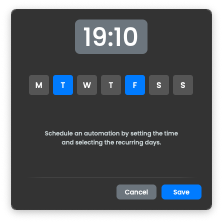

<h1 align="center">AutoMate</h1>

<div align="center">

[](https://github.com/OldManny/AutoMate/actions/workflows/test.yml) [](https://results.pre-commit.ci/latest/github/OldManny/AutoMate/main)

</div>

**AutoMate** is a Python-based tool that automates common tasks like organizing files, sending emails, and handling data entry. Its user-friendly interface is built with PyQt5. Whether you need to keep files tidy, schedule recurring tasks, or manage data, AutoMate provides a convenient all-in-one solution.

<p align="center">
  
</p>

# Table of Contents

- [Features](#features)
- [Setup](#setup)
  - [Authentication](#authentication)
- [Usage](#usage)
  - [Files](#files)
  - [Email](#email)
  - [Data](#data)
  - [Schedule](#schedule)
  - [Running](#running)
  - [Info](#info)
- [Undo](#undo)
- [Testing](#testing)
- [Attribution](#attribution)


## Features

- **File Organization**: Sort files by type, date and size, rename, compress, and backup files. Detect and relocate duplicates with ease.
- **Email Sending**: Quickly send emails with attachments or schedule them for later delivery (feature in active development).
- **Data Entry Automation**: Streamline your workflow by automating data entry for various file formats (feature under development).
- **Automation Scheduling**: Set automated tasks to run at specific times or days.
- **User-Friendly Interface**: Access all features from a clean, intuitive PyQt5 interface.


## Setup

1. **Clone the repository**

    ```sh
    git clone https://github.com/OldManny/AutoMate.git
    cd AutoMate
    ```

2. **Create a virtual environment**

    ```sh
    python3 -m venv .venv
    ```

3. **Activate the virtual environment**

    ```sh
    source venv/bin/activate  # On Windows use `.\venv\Scripts\activate`
    ```

4. **Install the dependencies**

    ```sh
    pip install -r requirements.txt
    ```

5. **Set up environment variables**

    Create a .env file in the root directory to store API credentials. (Further details will be added once the email automation feature is complete.)


### Authentication

When setting up AutoMate for the first time, you’ll now see a **Login** or **Register** prompt. Create your account using a secure password, which will be encrypted and stored locally.

The login system:

- **bcrypt-based encryption**: Passwords are hashed using bcrypt and stored locally for enhanced security.
- **Local storage**: No passwords leave your machine. All authentication data remains under your control.
- **Registration & login forms**: Register or log in to gain access to the application’s full feature set.


## Usage


### Files


<p align="center">
  
</p>


From the sidebar, select Files to open the file management area. The interface has been updated for clarity:

1. **Select Folder**: Click on the folder icon and select the target folder.

2. **Sort by Type**: Move files into directories based on their file type (e.g., images, documents).

3. **Sort by Date**: Organize files by their modification date.

4. **Sort by Size**: Group files into categories based on their size.

5. **Detect Duplicates**: Identify and move duplicate files to a "duplicates" folder.

6. **Rename Files**: Bulk rename with a specific naming pattern.

7. **Compress Files**: Compress all files into a single ZIP archive.

8. **Backup Files**: Save an additional copy of your files.

Use **Undo** to revert your last operation, and **Run** to execute your chosen tasks. Select **Schedule** from the sidebar to schedule one or more tasks.


### Email


<p align="center">
  
</p>


This feature integrates with the [Mailgun API](https://www.mailgun.com/) using your Mailgun credentials from environment variables.

1. **Add Mailgun Credentials** in an .env file set at the root level of you project directory. For example:

    ```sh
    MAILGUN_API_KEY=your-mailgun-api-key
    MAILGUN_DOMAIN=yourdomain.mailgun.org
    ```

2. **Fill Out the Fields**

   - **To**: Specify recipient addresses (comma-separated for multiple). Must match an authorized Mailgun receiver for free tier, which is easy to set up in your mailgun account.
   - **Cc**: (Optional) Add email addresses to carbon-copy.
   - **Subject**: Provide a concise subject line.
   - **From**: Insert the sender's address.

3. **Write Your Email**
Use the large text area to draft your email body. Drag and drop to add files as needed. Attachments will be included in your outgoing message.

4. **Send Immediately**
Click Send to dispatch the email through Mailgun. If successful, you’ll see a confirmation and your fields will be cleared.

5. **(Optional) Schedule for Later**
If you wish to send the email at a future time (or have it repeat on certain days), select Schedule from the sidebar after you completed all fields required in the Email window. Set your desired time and days to automate sending:

   - **Time**: When the email should go out.
   - **Days**: Which days to repeat (for recurring emails).

**Note**: Unlike file operations, there is no “Undo” once an email is sent. Make sure your addresses and attachments are correct before clicking **Send**.


### Data


<p align="center">
  
</p>


The **Data** module automates CSV/Excel operations via two actions:

  **Merge**
  - Combine data from multiple CSV/Excel files into one master file.
  - If the master file already has columns (even if it has no rows), that structure is respected. The merge copies data only into the columns that match via synonyms, ignoring additional columns from the source files.
  - If the master file is empty (no columns at all), all relevant columns from the source files are carried over.
  - Name fields (“First/Last Name” vs. “Full Name”) are automatically handled. The application checks the master file’s existing name format: if it only has “Full Name,” incoming data is combined; if it only has split columns, incoming “Full Name” fields are split. It handles various column fields, not only Names.

  **Mirror**
  - Copy the master file’s contents to one or more target files, syncing columns as needed.
  - Existing columns in each target file remain intact, and only matching columns get updated with master data. Empty targets inherit the master’s columns.

This allows flexible usage:

  - To **import only certain columns**, create or prepare a master/target file containing just those columns. The rest will be ignored.
  - To **import everything**, use an empty file so all columns from the sources are included.
  - All name column logic applies as above (automatically merging or splitting Full/First/Last and more as needed).

  **Undo**
  - Each merge or mirror allows to revert the master or target files to their pre‐operation state by using the **Undo** button.


### Schedule

<p align="center">
  
</p>

Automate tasks, such as file operations or sending emails by scheduling them at specific times and days. Once created, schedules are handled by a background daemon, allowing tasks to run even if you close the app. This daemon uses [APScheduler](https://apscheduler.readthedocs.io/en/stable/) and remains persistent across sessions:

   - **Automatic Pause & Resume**: If your OS goes to sleep, the scheduling daemon pauses. Once your machine wakes, tasks resume automatically.
   - **Recurring Tasks**: Pick a time and choose the days (e.g., weekdays) for your automation. The same tasks will run each specified day at the scheduled time.
   - **Local JSON Sync**: A dedicated JSON file keeps track of all scheduled jobs (additions or deletions). A watchdog monitors changes and updates APScheduler accordingly, so any adjustments via the app interface are instantly reflected in the schedule.
   - **File, Email and Data Compatibility**: Schedule file operations (like “Sort by Date” or “Compress Files”) as well as emails (via Mailgun). Both use the same scheduling framework.

This ensures complete control over automations, even when the app is closed.


### Running

<p align="center">
  
</p>

The Running modal provides real-time status and management of ongoing or scheduled tasks:

  - **Type**: The type of task being executed (e.g., Sort by Size, Rename Files).
  - **Target**: The target directory for the automation.
  - **Time**: The scheduled time for the task.
  - **Days**: Indicates recurring tasks by showing the selected days.

Use the red ❌ icon to cancel a task before it begins.


### Info

<p align="center">
  
</p>

An Info modal offers quick, context-sensitive tips and instructions for each feature, making it easy to understand and use.


## Undo

The Undo button in the File and Data dialogs will revert the last performed action. This is handy if you need to reverse an accidental move, rename, or other operation.


## Testing

To run tests for the Files, Email, Authentication and Scheduler modules (others are in progress):

1. Navigate to the project root directory.
2. Execute:
    ```sh
    pytest tests/
    ```

Future tests for **Data** module are under development.


## Attribution


- Icons from [Freepik](https://www.freepik.com/):
    - [Favourite folder icon](https://www.freepik.com/icon/favourite-folder_11471618#fromView=search&page=1&position=42&uuid=622cae6d-d6fe-404e-b11b-ecc936850666) by [juicy_fish](https://www.freepik.com/author/juicy-fish/icons)
    - [Cancel icon](https://www.freepik.com/icon/cancel_8532367) by [Muhammad Waqas Khan](https://www.freepik.com/author/muhammad-waqas-khan/icons)
