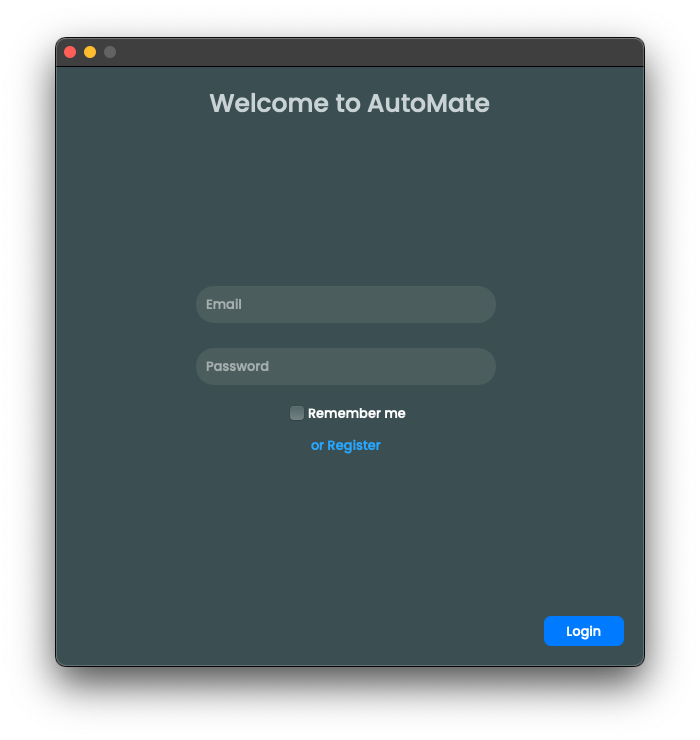

<h1 align="center">AutoMate</h1>

<div align="center">

[](https://github.com/OldManny/AutoMate/actions/workflows/test.yml) [](https://results.pre-commit.ci/latest/github/OldManny/AutoMate/main)

</div>

**AutoMate** is a Python-based tool that automates common tasks like organizing files, sending emails, and handling data entry. Its user-friendly interface is built with PyQt5. Whether you need to keep files tidy, schedule recurring tasks, or manage data, AutoMate provides a convenient all-in-one solution.

<p align="center">
  
</p>

# Table of Contents

- [Features](#features)
- [Setup](#setup)
  - [Authentication](#authentication)
- [Usage](#usage)
  - [Files](#files)
  - [Email](#email)
  - [Data](#data)
  - [Schedule](#schedule)
  - [Running](#running)
  - [Info](#info)
- [Undo](#undo)
- [Testing](#testing)
- [Attribution](#attribution)


## Features

- **File Organization**: Sort files by type, date and size, rename, compress, and backup files. Detect and relocate duplicates with ease.
- **Email Sending**: Quickly send emails with attachments or schedule them for later delivery (feature in active development).
- **Data Entry Automation**: Streamline your workflow by automating data entry for various file formats (feature under development).
- **Automation Scheduling**: Set automated tasks to run at specific times or days.
- **User-Friendly Interface**: Access all features from a clean, intuitive PyQt5 interface.


## Setup

1. **Clone the repository**

    ```sh
    git clone https://github.com/OldManny/AutoMate.git
    cd AutoMate
    ```

2. **Create a virtual environment**

    ```sh
    python3 -m venv .venv
    ```

3. **Activate the virtual environment**

    ```sh
    source venv/bin/activate  # On Windows use `.\venv\Scripts\activate`
    ```

4. **Install the dependencies**

    ```sh
    pip install -r requirements.txt
    ```

5. **Set up environment variables**

    Create a .env file in the root directory to store API credentials. (Further details will be added once the email automation feature is complete.)


### Authentication

When setting up AutoMate for the first time, you’ll now see a **Login** or **Register** prompt. Create your account using a secure password, which will be encrypted and stored locally.

The login system:

- **bcrypt-based encryption**: Passwords are hashed using bcrypt and stored locally for enhanced security.
- **Local storage**: No passwords leave your machine. All authentication data remains under your control.
- **Registration & login forms**: Register or log in to gain access to the application’s full feature set.


## Usage


### Files

<p align="center">
  
</p>

From the sidebar, select Files to open the file management area. The interface has been updated for clarity:

1. **Select Folder**: Click on the folder icon and select the target folder.

2. **Sort by Type**: Move files into directories based on their file type (e.g., images, documents).

3. **Sort by Date**: Organize files by their modification date.

4. **Sort by Size**: Group files into categories based on their size.

5. **Detect Duplicates**: Identify and move duplicate files to a "duplicates" folder.

6. **Rename Files**: Bulk rename with a specific naming pattern.

7. **Compress Files**: Compress all files into a single ZIP archive.

8. **Backup Files**: Save an additional copy of your files.

Use **Undo** to revert your last operation, and **Run** to execute your chosen tasks. Select **Schedule** from the sidebar to schedule one or more tasks.


### Email

**Under Development**: Sending emails and scheduling future deliveries.


### Data

**Under Development**: Automate data entry tasks for CSV, Excel, and PDF files.


### Schedule

Automate your tasks by scheduling them at specific times and days. The scheduler allows to pick a time and select recurring days for executing tasks.

<p align="center">
  
</p>

### Running

The Running modal provides real-time status and management of ongoing or scheduled tasks:

  - **Type**: The type of task being executed (e.g., Sort by Size, Rename Files).
  - **Target**: The target directory for the automation.
  - **Time**: The scheduled time for the task.
  - **Days**: Indicates recurring tasks by showing the selected days.

Use the red ❌ icon to cancel a task before it begins.

<p align="center">
  
</p>

### Info

An Info modal offers quick, context-sensitive tips and instructions for each feature, making it easy to understand and use.

<p align="center">
  
</p>

## Undo

The Undo button in the File and Data dialogs will revert the last performed action. This is handy if you need to reverse an accidental move, rename, or other operation.


## Testing

To run tests for the Files module (others are in progress):

1. Navigate to the project root directory.
2. Execute:
    ```sh
    pytest tests/
    ```

Future tests for **Email** and **Data** modules are under development.


## Attribution


- Icons from [Freepik](https://www.freepik.com/):
    - [Favourite folder icon](https://www.freepik.com/icon/favourite-folder_11471618#fromView=search&page=1&position=42&uuid=622cae6d-d6fe-404e-b11b-ecc936850666) by [juicy_fish](https://www.freepik.com/author/juicy-fish/icons)
    - [Folder icon](https://www.freepik.com/icon/folder_5656334#fromView=search&page=2&position=44&uuid=cdb3aadb-5903-44e2-9587-04d09fab2e19) by [Uniconlabs](https://www.freepik.com/author/batitok/icons)
    - [Cancel icon](https://www.freepik.com/icon/cancel_8532367) by [Muhammad Waqas Khan](https://www.freepik.com/author/muhammad-waqas-khan/icons)
    - [Drawer icon](https://www.freepik.com/icon/drawer_9664809#fromView=resource_detail&position=8) by [manshagraphics](https://www.freepik.com/author/manshagraphics/icons)
    - [Envelope icon](https://www.freepik.com/icon/envelope_9664378) by [manshagraphics](https://www.freepik.com/author/manshagraphics/icons)
    - [Paper icon](https://www.freepik.com/icon/paper_9869732#fromView=resource_detail&position=36) by [manshagraphics](https://www.freepik.com/author/manshagraphics/icons)
    - [Clock icon](https://www.freepik.com/icon/clock_11154923#fromView=family&page=5&position=3&uuid=523796c9-7b80-406c-b98f-1169f4373228) by [manshagraphics](https://www.freepik.com/author/manshagraphics/icons)
    - [Cogwheel icon](https://www.freepik.com/icon/cogwheel_9870010#fromView=family&page=1&position=38&uuid=b4f72613-4795-4d96-acdf-4d6d7ced619f) by [manshagraphics](https://www.freepik.com/author/manshagraphics/icons)
    - [Key tag icon](https://www.freepik.com/icon/key-tag_9664428#fromView=family&page=3&position=67&uuid=3a40df76-39c0-4199-970b-4e4fa99cadef) by [manshagraphics](https://www.freepik.com/author/manshagraphics/icons)
