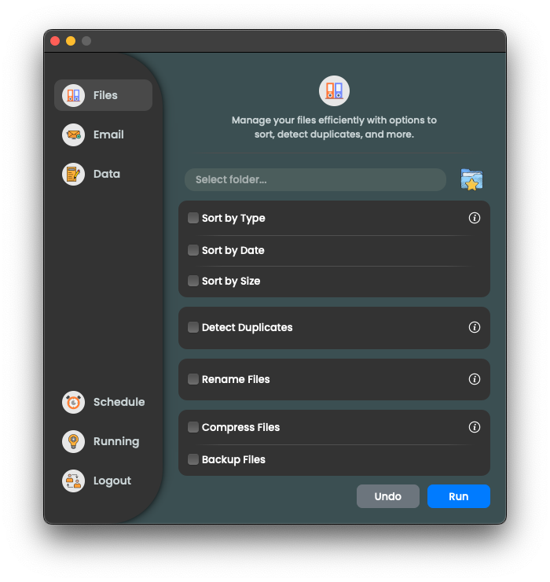

<h1 align="center">AutoMate</h1>

<div align="center">

[](https://github.com/OldManny/AutoMate/actions/workflows/test.yml) [](https://results.pre-commit.ci/latest/github/OldManny/AutoMate/main)

</div>

This tool is designed to automate various tasks such as organizing files, sending emails, and automating data entry. It is built using Python and PyQt5 for the user interface.

<p align="center">
  
</p>


# Table of Contents

- [Features](#features)
- [Setup](#setup)
- [Usage](#usage)
  - [Files](#files)
  - [Email](#email)
  - [Data](#data)
  - [Schedule](#schedule)
  - [Info](#info)
- [Undo](#undo)
- [Testing](#testing)
- [Attribution](#attribution)


## Features

- **File Organization**: Sort files by type, date, size, detect duplicates, rename, compress, and backup files.
- **Email Sending**: Easily send emails with attachments immediately or schedule them for later.
- **Data Entry Automation**: Automate data entry for CSV, Excel, and PDF files.
- **User-Friendly Interface**: Easy-to-use interface built with PyQt5.
- **Automation Scheduling**: Schedule repetitive automation tasks to run at specified times.


## Setup

1. **Clone the repository**

    ```sh
    git clone https://github.com/OldManny/AutoMate.git
    cd AutoMate
    ```

2. **Create a virtual environment**

    ```sh
    python3 -m venv .venv
    ```

3. **Activate the virtual environment**

    ```sh
    source venv/bin/activate  # On Windows use `.\venv\Scripts\activate`
    ```

4. **Install the dependencies**

    ```sh
    pip install -r requirements.txt
    ```

5. **Set up environment variables**

    Create a `.env` file in the root directory and add your API credentials and the src folder path. More instructions to come, once the Email automation feature is implemented.


## Usage


### Files

<p align="center">
  
</p>

1. Click on "Organize Files" to open the file organization customization dialog.

2. **Sort by Type**: Move files into directories based on their file type (e.g., images, documents).

3. **Sort by Date**: Organize files by their modification date.

4. **Sort by Size**: Group files into categories based on their size.

5. **Detect Duplicates**: Identify and move duplicate files to a "duplicates" directory.

6. **Rename Files**: Rename files based on a specific pattern.

7. **Compress Files**: Compress all files into a single ZIP archive.

8. **Backup Files**: Create a backup of all files.


### Schedule

Automate your tasks by scheduling them at specific times and days. The scheduler allows to pick a time and select recurring days for executing tasks.

<p align="center">
  
</p>

### Info

Get contextual information about features and their usage directly within the app through a clean and intuitive info modal.

<p align="center">
  
</p>

### Email

**Under Development**


### Data

**Under Development**


## Undo

Both the Organize Files and Automate Data Entry dialogs will include an "Undo" button. This feature allows reverting to the last operation performed. If something is done accidentally, it is easy to undo these actions and restore to the previous state.


## Testing

Tests for the **Files** module are completed and can be run using `pytest`. To execute the tests:

1. Navigate to the project's root directory.
2. Run the following command:
    ```sh
    pytest tests/
    ```

Tests for other modules like **Email** and **Data** are under development and will be added in future updates.


## Attribution


- Icons from [Freepik](https://www.freepik.com/):
    - [Favourite folder icon](https://www.freepik.com/icon/favourite-folder_11471618#fromView=search&page=1&position=42&uuid=622cae6d-d6fe-404e-b11b-ecc936850666) by [juicy_fish](https://www.freepik.com/author/juicy-fish/icons)
    - [Folder icon](https://www.freepik.com/icon/folder_5656334#fromView=search&page=2&position=44&uuid=cdb3aadb-5903-44e2-9587-04d09fab2e19) by [Uniconlabs](https://www.freepik.com/author/batitok/icons)
